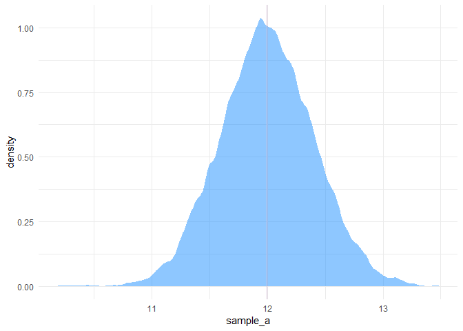
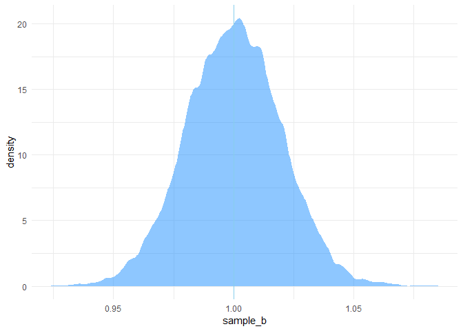
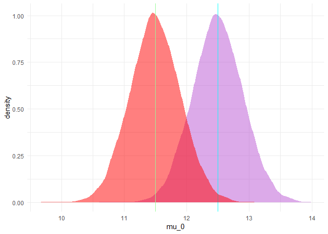
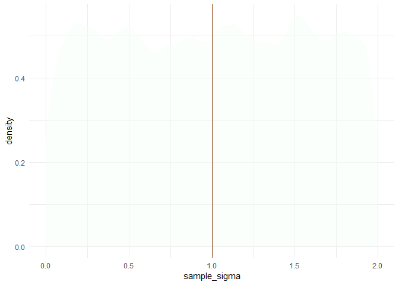

Analyse - Empra Sommersemester 2019
================
Jonas Großekathöfer
07\. Juni 2019

``` r
#Zeugs, dass wir irgendwie benötigen
library(tidyverse)
library(ggplot2)

N <- 1e4 # festlegen, wie oft (später) zufällig "Proben" entnommen werden, eine
         # 1 mit 4 Nullen: 10.000
```

# Vorannahmen veranschaulischen

## Ziele

  - Herausfinden, was **vernünfitge** Vorannahmen sind
      - Wie schnell gehen Menschen über die Ampel?
      - Wie viel gehen Menschen schneller wenn sie angestarrt werden
        (vglb.[Ellsworth et al.,
        1972](https://psycnet.apa.org/doi/10.1037/h0032323))?
  - Eine Stichprobenschätzung für die vermutete Effektgröße mit einer
    akzeptable Power (von .8) für das konventionelle Signifikanzniveau
    (von .05).

## Vorgehen

  - Ein Modell mit guten Parametern aufstellen, dass realistische
    Mittelwerte generiert
  - Parameter festlegen
      - Mittelwerten\[1\] für reguläre Überquerungszeiten: `a`
          - regulär, im Sinne von “ohne Manipulation”
      - den Effekt, wie stark `starren` die Überquerungszeiten
        verändert: `b`
  - Modell auf Plausibilität prüfen, vorzugsweise anhand von Grafiken
      - Ist die mittlere Überquerungszeit zu langsam? Variiert die
        Überquerungszeit stärker als im Plot zu sehen?
      - Ist die Effektgröße stärker, als wir es erwarten?
  - Poweranalyse

## Modell

Vorannahme: Die `zeit` die Menschen benötigen um eine Ample zu
überqueren unterliegt einer
[Normalverteilung](https://de.wikipedia.org/wiki/Normalverteilung).

`zeit ~ dnorm(mu, sigma)`

Eine Normalverteilung wird durch zwei Werte beschrieben, den Mittelwert
`mu` und die Standardabweichung `sigma`.

Da wir nicht sonderlich daran interessiert sind, wie viel Zeit Menschen
zur Überquerung von Ampeln benötigen müssen wir noch unseren *Prädiktor*
das Starren hinzufügen: `mu` sollte (laut Hypothese) unterschiedlich
sein, je nach dem, ob jemand angestarrt wurde, oder nicht.

### Parameter

Wir gehen von einem *linearen Einfluss* des Starrens auf `mu`
aus.

#### mu

<!-- Menschen benötigen unterschiedlich lange für das überqueren der Straße, je nach dem, ob sie angestarrt werden, oder nicht. Dabei ist `mu` kleiner (d.h. die Zeit für die Überquerung der Straße ist kürzer), wenn die Menschen zuvor angestarrt wurden -->

Wir nehmen an, dass `mu` sich aus der Summe der **durschschnittlichen
Zeit zur Überquerung** (der Straße) und einem **Effekt des Starrens**
ergibt.

#### a: durschschnittliche Zeit zur Überquerung

Auch hier gehen wir davon aus, dass die Werte einer Normalverteilung
entspringen: `a ~ dnorm(m, sd)` \* m = Mittelwert der Zeit die Menschen
benötigen um die Straße zu überqueren. \* quasi der Wert, den wir
bekommen würden, wenn wir nur die Zeit nehmen, die Menschen benötigen um
die Straße zu überqueren. \* sd = Abweichungen, wie **unterschiedlich**
lange Menschen benötigen, um die Straße zu überqueren.

#### b\*x: Effekt des Starrens

Zu `a` müssen wir also noch den Effekt des Starrens addieren, und zwar
die Veränderung der Zeit durch das Starren: `b * x`

##### x: Starren

`x` ist von uns als eine dichotome Variable definiert: -1 = **angestarrt
werden** und 0 = **nicht angestarrt werden** \* Frage 1: Warum wohl
nicht 1 und 0?

##### b: Veränderung durch Starren

Grundsätzlich gehen wir auch hier davon aus, dass die Veränderung durch
das Starren (“der Effekt”) aus einer Normalverteilung kommt. Dadurch,
dass wir aber außschließlich positive Effekte erwarten\[2\] definieren
wir `b` als log-normalverteilt (d.h., der Logarithmus von `b` ist
normalverteilt): `b ~ dlnorm(mean, sd)`

## Parameter ausprobieren

`mu` ergibt sich nun also aus einem *lineare Model* mit dem wir
berechnen können, wie viel schneller Menschen sind, die angestarrt
werden: `mu = a + b * x`

Dabei können wir in das Model realistische Zahlen einsetzen.
Beispielsweise, dass Menschen zur Überquerung der Straße im Schnitt 12
Sekunden (mit einer SD von .4 Sekunden) benötigen.

``` 

zeit ~ dnorm(mu, sigma)

mu <- a + b * x

a ~ dnorm( 12 , .4 )
b ~ dlnorm( 0 , .02 )

sigma ~ dunif( 0 , 2 ) # Stanardabweichung
```

#### Frage

  - Was passiert, wenn starren im o.g. Model *0*, *1* oder *-1* ist?

### Standadisieren rückgängig machen

Bisher zeigt der Term `b * x` nur die Veränderung von einer Einheit an.
Wie groß diese ist, müssen wir uns überlegen, um darauf basierend die
nötige Stichprobengröße zu bestimmen.

Um den Effekt in Sekunden zu bekommen, muss `x` mit dem erwarteten
Effekt multipliziert werden: Bei einem erwarteten Effekt von 5 Sekunden:
`b * x * 5`

### sigma (nicht vergessen)

Menschen laufen von sich aus unterschiedlich schnell, diese Schwankungen
können durch die breite der Normalverteilung beschrieben werden. \* Ein
großes `sigma` bedeutet also, dass Menschen sehr unterschiedlich auf
angestarrt werden reagieren

## Plausibilität

Wenn unser Modell perfekt die Welt beschreibt, müssen *nur* noch die
*wahren* Parameter dem Model hinzugefügt werden, und wir bräuchten keine
Versuchsperson mehr erheben.

Beides kennen wir nicht, aber wir können unser Model so optimieren, dass
die *synthetischen* Daten die es produziert, *möglichst* ähnlich den
*empirisch* Daten sind. Dazu vergleichen wir, unsere Parameter mit
erwartbaren Werten. Los geht’s\!

### Plausibilität von `a`

``` r
# mittlere Überquerungsgeschwindigkeit ist 'mean' und variiert um 'sd'
sample_a <- rnorm( N , mean=12 , sd=.4 )

ggplot() +
    aes(x=sample_a) +
    stat_density(
        adjust = .5,
        fill = random_color(),
        alpha = .5) +
    geom_vline(xintercept = mean(sample_a), color = random_color()) +
    theme_minimal()
```

<!-- -->

#### Frage

  - Sind die Werte für `a` plausibel?
  - Was bedeutet die Linie?

### Plausibilität von `b`

``` r
# mittlerer Effekt 'meanlog', variiert um 'sd_log'
sample_b <- rlnorm( n=N , meanlog=0 , sdlog=.02 ) # log transformieren, eine Möglichkeit
                                  # sicherzustellen, dass alle Werte positiv
                                                # sind

ggplot() +
    stat_density(
        aes(x=sample_b),
        adjust = .5,
        fill = random_color(),
        alpha = .5) +
    geom_vline(xintercept = mean(sample_b), color = random_color())+
    theme_minimal()
```

<!-- -->

#### Frage

  - Sind die Werte für `b` plausibel?
  - Was bedeutet die Linie?

### Plausibilität von `mu`

``` r
# Unabhängige Variable
# x = starren beschleunigt in Sekunden
# ginge auch standardisiert mit 0 & 1, oder 0.5 & -0.5
x_0 = 0  # kein starren: kein Effekt
x_1 = -1 # starren: eine Sekunde schneller, als sonst

x_bar = mean(c(x_0, x_1))
x_bar
```

    ## [1] -0.5

``` r
mu_1 <- sample_a + sample_b * (x_1 - x_bar) * 1 # den Effekt in Sekunden umrechnen
mu_0 <- sample_a + sample_b * (x_0 - x_bar) * 1

avg_mu_sim <- tibble(sample_a, sample_b, mu_1, mu_0)

ggplot(data=avg_mu_sim) +
    stat_density(aes(x=mu_0), fill = random_color(), alpha = .5) +
    geom_vline(xintercept = mean(mu_0), color = random_color()) +
    stat_density(aes(x=mu_1), fill = "red", alpha = .5) +
    geom_vline(xintercept = mean(mu_1), color = random_color())+
    theme_minimal()
```

<!-- -->

### Plausibilität von `mu`

``` r
# wird erst später benötigt
sample_sigma <- runif( n=N , min=0 , max=2) # wird erst später relevant

ggplot() +
    stat_density(
        aes(x=sample_sigma),
        adjust = .5,
        fill = random_color(),
        alpha = .5) +
    geom_vline(xintercept = mean(sample_sigma), color = random_color())+
    theme_minimal()
```

<!-- -->

# Stichprobengröße bestimmen

Um die Stichprobengröße zu bestimmen haben wir jetzt alles, was wir
benötigen. Nun können wir uns Daten beliebig oft simulieren und
statistisch auswerten. Da wir die **Wahrheit** über unser Model kennen
(H\_1 ist wahr), wissen wir, dass jeder nicht signifikante Test ein
[Fehler 2.
Art](https://de.wikipedia.org/wiki/Trennsch%C3%A4rfe_eines_Tests#Entscheidungstabelle)
ist. Durch die Simulation können wir entscheiden, wie konservativ oder
liberal wir unsere Hypothesen formulieren wollen, und was das für unsere
Stichprobengröße bedeutet.

``` r
# Anzahl der Simulationen
nsims <- 100

# Stichprobengröße
nsubjects <- 50

# Signifikanzniveau
alpha <- .05

# Effektgröße
effect_size <- .8 # to scale x according to effect size


df_sim_data <- tibble()
p_values <- tibble()
stare_seq <- c(0,1)

for (sim in 1:nsims){

    time_crossing <- sapply( stare_seq , function(stare)
    rnorm(

        n = nsubjects/2,
        mean = sample_a + sample_b * ( stare - x_bar ) * effect_size ,
        sd = sample_sigma ) )

    sim <-  tibble(sim_n = sim, stare=time_crossing[,1], no_stare=time_crossing[,2])

    p_value <- tibble(p_value = t.test(sim$stare, sim$no_stare)$p.value)

    df_sim_data <- rbind(df_sim_data, sim)
    p_values <- rbind(p_values, p_value)
}

p_values$below_alpha <- ifelse(p_values$p_value <= alpha, 1, 0)

sum(p_values$below_alpha)/nrow(p_values)*100
```

    ## [1] 57

``` r
# 1000 simulierte Studien
df_sim_data <- df_sim_data %>% group_by(sim_n) %>% summarise(
    mean_stare = mean(stare),
    # sd_stare = sd(stare),
    mean_no_stare = mean(no_stare),
    # sd_no_stare = sd(no_stare),
    effect_size = mean_stare - mean_no_stare) %>%
    cbind(p_values)
```

``` r
ggplot(data = df_sim_data, aes(x = p_value)) +
    stat_density(
        adjust = .5,
        fill = random_color(),
        alpha = .5) + # anderes alpha!
    geom_vline(xintercept = alpha, color = random_color())+
    theme_minimal()
```

<!-- -->

1.  inkl. Standardabweichung, Vorraussetung um Normalverteilungen zu
    nutzen (siehe unten)

2.  Achtung, ist abhängig davon, in welche Richtung der Effekt definiert
    ist\! Siehe Frage 1. Hier gehen wir davon aus, dass jemand weniger
    Zeit benötigt. Der Term `b * x` sollte entsprechend negativ werden,
    wenn er zu `a` hinzuaddiert wird. Das ganze kann auch anderesherum
    kodiert werden.
