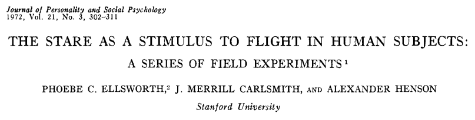

```{r setup, include=FALSE}
options(htmltools.dir.version = FALSE)

library(tidyverse)
#library(kableExtra)
library(knitr)

### Sitzungen
source("../scripts/dates.R", encoding = "UTF-8")
source("../scripts/random_color.R", encoding = "UTF-8")
farbe_der_woche = random_color()

```

## Versuchsaufbau

--

### Gütekriterien

+ Objektivitität
+ Reliabilität

---

## Hypothesen

--

### Gütemerkmale

+   Falsifizierbarkeit

+   Präzisierbarkeit

+   Theorierelevanz

+   Parsimonität ([Occam's Razor](https://de.wikipedia.org/wiki/Ockhams_Rasiermesser))

--

    > In no case is an animal activity to be interpreted in terms of higher psychological processes, if it can be fairly interpreted in terms of processes which stand lower in the scale of psychological evolution and development.” (Morgan, 1906)


.footnote[

aus: Reiß, S. & Sarris, V. (2012). Experimentelle Psychologie: Von Theorie zur Praxis. Pearson Studium.

]

???

präzisierbarkeit durch weiteren Faktor

---

class: inverse

# Nächste Woche (entfällt)

 ---

+    

    +  Einleitung, Experiment IV (Methoden und Ergebnisse) & Diskussion
    +  Eigenes Versuchsdesign gemeinsam erarbeiten
    +  Zum Kontrast: [Dieses](https://www.frontiersin.org/articles/10.3389/fpsyg.2018.01587/full) aktuelle(!) Review **lesen**

+   [`r icon::fa_hand_point_right()` AsPredicted](https://www.aspredicted.org)
    +   Was ist [*pre-registration*](https://www.apa.org/science/about/psa/2015/08/pre-registration.aspx)?
        +   [Oder](https://www.nature.com/articles/s41562-016-0021), [oder](http://blogs.discovermagazine.com/neuroskeptic/2012/04/14/fixing-science-systems-and-politics), [oder](http://www.cogsci.nl/blog/miscellaneous/215-the-pros-and-cons-of-pre-registration-in-fundamental-research) (dann [mit](http://blogs.discovermagazine.com/neuroskeptic/2013/04/25/for-preregistration-in-fundamental-research/)), [oder](https://www.theguardian.com/science/head-quarters/2014/may/20/psychology-registration-revolution), [oder](https://www.theguardian.com/science/head-quarters/2017/may/09/from-protoscience-to-proper-science-the-path-ahead-for-reforming-psychology), [oder](http://lmgtfy.com/?s=d&q=preregistration+psychology), ...
    +   ausfüllen der *aspredicted*-Preregistrierung (9 Fragen, soweit möglich)

---
class: inverse, center, middle

# Noch Fragen?

---

class: inverse, center, middle

`r icon::fa_smile(size = 5, color = farbe_der_woche)`

Die Farbe der Woche ist `r farbe_der_woche`!

--

# Vielen Dank für Eure Aufmerksamkeit!


## Bis nächsten Montag.

--

.footnote[

<font size="-2">Slides created via the R packages [**xaringan**](https://github.com/yihui/xaringan) and [knitr](http://yihui.name/knitr), and [R Markdown](https://rmarkdown.rstudio.com).

<a rel="license" href="http://creativecommons.org/licenses/by-sa/4.0/"></a><br />Dieses Werk ist lizenziert unter einer <a rel="license" href="http://creativecommons.org/licenses/by-sa/4.0/">Creative Commons Namensnennung - Weitergabe unter gleichen Bedingungen 4.0 International Lizenz</a>.</font size>

]

