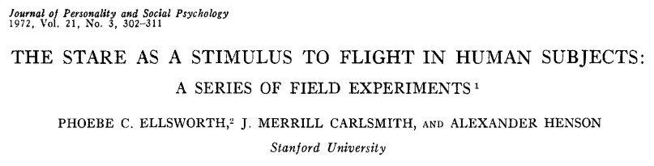

```{r setup, include=FALSE}

options(htmltools.dir.version = FALSE)

library(tidyverse)
library(knitr)

### Sitzungen
source("../scripts/dates.R", encoding = "UTF-8")
source("../scripts/random_color.R", encoding = "UTF-8")
farbe_der_woche = random_color()

```

[](https://doi.org/10.3389/fpsyg.2018.01587)

---

[](https://doi.org/10.1037/h0032323)

---

# Eigenes Projekt

.center[

`r icon::fa_vial(size=5, color = farbe_der_woche)`

`r icon::fa_burn(size=5, color = "orange")`

]

---

[](https://aspredicted.org)

siehe [hier](https://aspredicted.org/create.php)

[](https://cos.io/prereg/)

siehe [hier](https://osf.io/9axfe/registrations?tab=drafts)

---

class: inverse

## Für nächste Woche:

???

+   Präregistrierung weiter bearbeiten
+   Design? Orte? Pilotieren? Hypothesen verbessern? Konkrete Umsetzung?
    
---
class: inverse, center, middle

# Noch Fragen?

---
class: inverse, center, middle

`r icon::fa_smile(size = 5, color = farbe_der_woche)`

Die Farbe der Woche ist `r farbe_der_woche`!

--

# Vielen Dank für Eure Aufmerksamkeit!

## Bis nächsten Montag.

--

.footnote[

<font size="-2">Slides created via the R packages [**xaringan**](https://github.com/yihui/xaringan) and [knitr](http://yihui.name/knitr), and [R Markdown](https://rmarkdown.rstudio.com).

<a rel="license" href="http://creativecommons.org/licenses/by-sa/4.0/"></a><br />Dieses Werk ist lizenziert unter einer <a rel="license" href="http://creativecommons.org/licenses/by-sa/4.0/">Creative Commons Namensnennung - Weitergabe unter gleichen Bedingungen 4.0 International Lizenz</a>.</font size>

]
