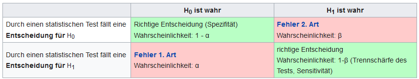

    
    ```{r setup, include=FALSE}

options(htmltools.dir.version = FALSE)

library(tidyverse)
#library(kableExtra)
library(knitr)

### Sitzungen
source("../scripts/dates.R", encoding = "UTF-8")
source("../scripts/random_color.R", encoding = "UTF-8")
farbe_der_woche = random_color()

```

## Preregistration

--

### Hypothese


--

### Stichprobengröße

#### Power

+  "die Wahrscheinlichkeit eines statistischen Tests die abzulehnende Nullhypothese („Es gibt keinen Unterschied“) korrekt zurückzuweisen, wenn die Alternativhypothese („Es gibt einen Unterschied“) wahr ist."

[](https://de.wikipedia.org/wiki/Trennsch%C3%A4rfe_eines_Tests#Entscheidungstabelle)

.center[

[http://rpsychologist.com/d3/NHST/](http://rpsychologist.com/d3/NHST/)

]

---
class: inverse

## Für nächste Woche:

+ Preregistration abgeschlossen?
+ Pilotieren?

---
class: inverse, center, middle

# Noch Fragen?

---
class: inverse, center, middle

`r icon::fa_smile(size = 5, color = farbe_der_woche)`

Die Farbe der Woche ist `r farbe_der_woche`!

--

# Vielen Dank für Eure Aufmerksamkeit!


## Bis nächsten Montag.

--

.footnote[
    
<font size="-2">Slides created via the R packages
[**xaringan**](https://github.com/yihui/xaringan) and
[knitr](http://yihui.name/knitr), and [R
                                       Markdown](https://rmarkdown.rstudio.com).

<a rel="license" href="http://creativecommons.org/licenses/by-sa/4.0/"></a><br />Dieses
Werk ist lizenziert unter einer <a rel="license"
href="http://creativecommons.org/licenses/by-sa/4.0/">Creative Commons
Namensnennung - Weitergabe unter gleichen Bedingungen 4.0 International
Lizenz</a>.</font size>
    
]
